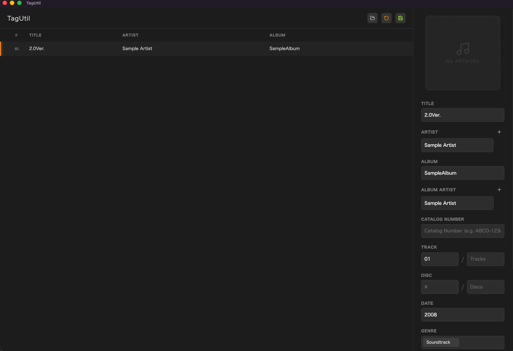

# TagUtil

<p align="center">
  
</p>

<p align="center">
  <strong>Functional FLAC metadata editor for macOS</strong>
</p>

<p align="center">
  <a href="https://github.com/super-kato/TagUtil/releases"></a>
  <a href="https://github.com/super-kato/TagUtil/blob/main/LICENSE"></a>
  <a href="https://github.com/super-kato/TagUtil/actions/workflows/test.yml"></a>
  <a href="https://github.com/super-kato/TagUtil/actions/workflows/release.yml"></a>
</p>

---

**TagUtil** is a desktop application specialized for editing FLAC file metadata on macOS.

## Features

- **Metadata Editing**: Full support for editing cover art, title, artist, album, track number, disc number, and more.
- **Multi-value Support**: Properly handles complex tag structures with multiple artists or genres.
- **Metadata-based Renaming**: Automatically rename files based on their metadata patterns (e.g., `TrackNo - Title.flac`).
- **Atomic Writing**: Ensures data integrity by using atomic operations to prevent corruption during the writing process.
- **Auto Updates**: Automatically detects and notifies when new versions are released to ensure you always have the latest features and stability.

## Screenshots

<p align="center">
  
</p>

## Installation

Download the latest version from the [Releases Page](https://github.com/super-kato/TagUtil/releases).

- **macOS**: Download the `.dmg` file and drag it into your Applications folder.

## Developer Guide

### Setup & Development

```bash
$ pnpm install
$ pnpm dev
$ pnpm build
```

### Binary Generation

```bash
# For Windows
$ pnpm build:win
# For macOS
$ pnpm build:mac
```
